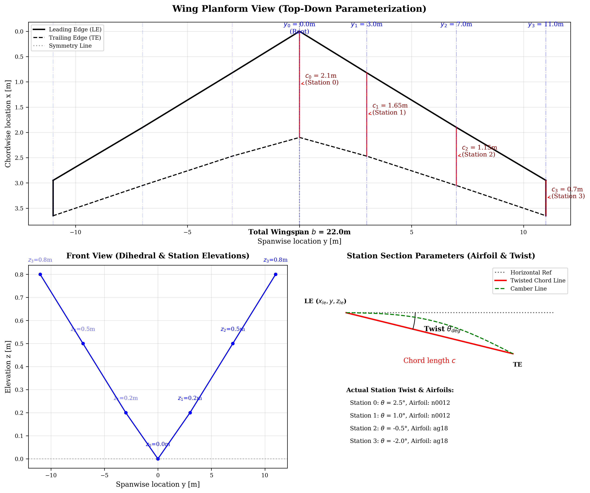
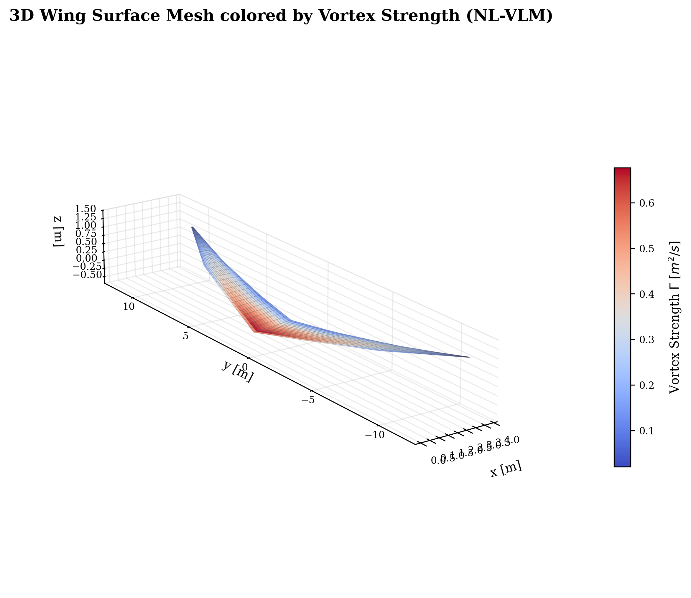
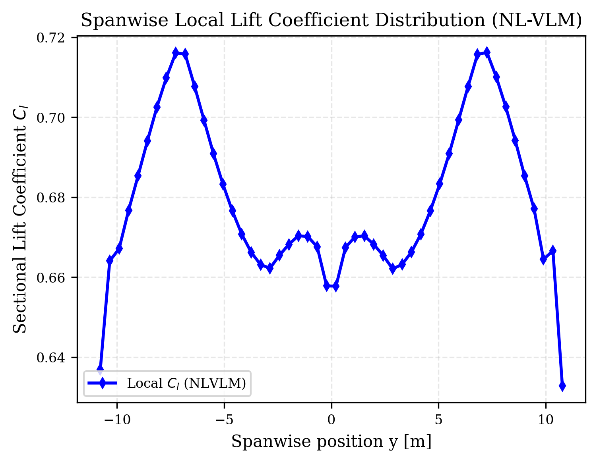
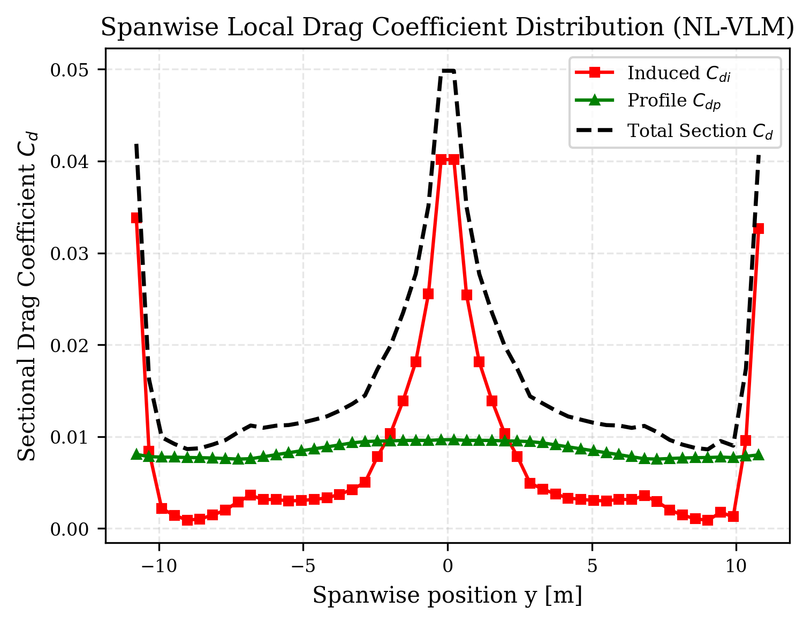
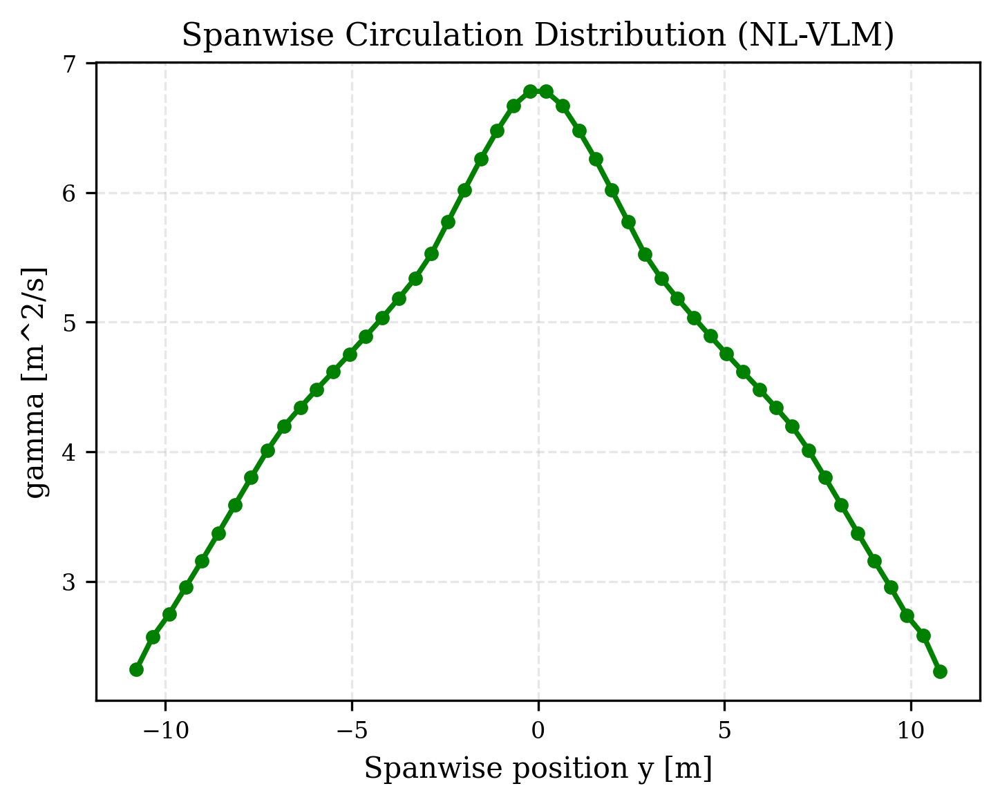
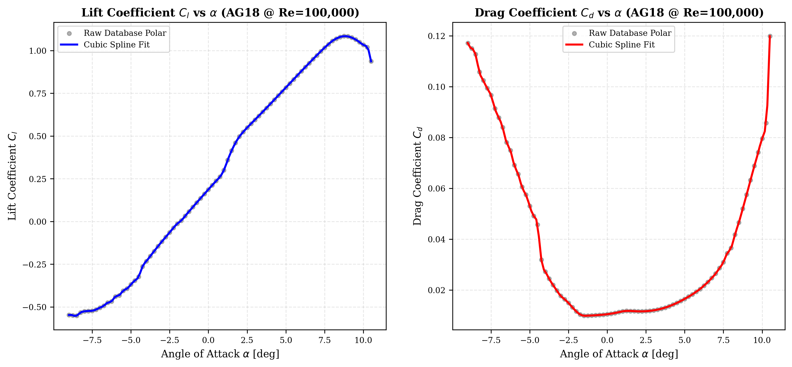
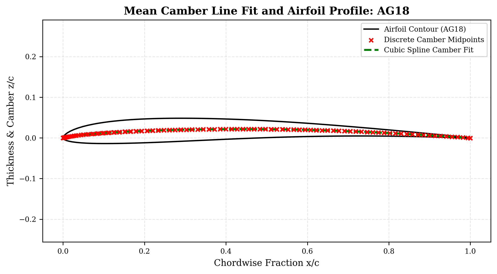

# 3DAERODYNAMICS VLM Solver Suite

**3DAERODYNAMICS** is an advanced 3D aerodynamic solver suite designed to calculate the lift, induced drag, and circulation distributions of custom lifting surfaces (wings) using panel methods. The package features two principal solvers:
1. **Linear Vortex Lattice Method ($\mathrm{VLM}$) Solver**
2. **Coupled Non-Linear Vortex Lattice Method ($\mathrm{NL}\text{-}\mathrm{VLM}$) Solver** (utilizing the decambering method linked to 2D experimental airfoil polars)

---

## Features & Toolchain

The suite integrates simulation, mesh generation, live configuration editing, and visualization in a single workflow:
* **Interactive CLI**: Launch `python3 run_solver.py` without arguments to access an interactive terminal menu with a custom logo, config viewer, and live editor.
* **Live Configuration Editor**: Modify AoA, speed, mesh density, convergence tolerance, VTU output paths, and station geometries (chords/twist) live from your terminal, saving updates back to `config.json` on-the-fly.
* **VTU Unstructured Grid Exports**: Solver outputs are saved as `.vtu` XML files containing points, quadrilateral cell connectivity, and cell-centered variables (circulation $\Gamma$, induced velocity $\vec{V}_{\mathrm{ind}}$, forces $\vec{F}$, area, decamber angles, and local profile drag coefficients) for ParaView compatibility.
* **Post-Processing**: Generate PDF and PNG plots of 3D heatmaps of vortex strength, spanwise circulation, spanwise local lift coefficient $C_l(y)$, and local induced/profile drag distributions.
* **ASCII Plots**: Visualize the 2D half-wing planform grid and the 3D isometric projection of the mean camber line directly in the console.

---

## Wing Parameterization & Online Airfoil Database

The geometry of the wing is defined using station-based multi-section configuration parameters (root-to-tip, chords, leading-edge sweep, dihedral elevations, twist angle, and airfoil names).

### Automatic Airfoil Lookup & Caching
The solver suite automatically connects to the **UIUC Airfoil Coordinates Database** (AirfoilTools) online to fetch geometry and polar performance datasets for any specified airfoil (e.g., `n0012`, `ag18`, `naca2412`). 
* **Airfoil Coordinates**: Downloaded from the Selig format database (`http://airfoiltools.com/airfoil/seligdatfile?airfoil=...`).
* **Polar Performance curves**: Downloaded for a Reynolds number of $Re = 1,000,000$ (`http://airfoiltools.com/polar/text?polar=xf-...`).
* **Caching**: Once downloaded, files are stored locally in the `airfoilDATA/` folder to prevent redundant network requests and allow offline execution.

### Cambers and Polars Fitting
For each section:
* The mean camber line $z_c(x)$ is extracted from coordinates and fitted with a 4th-degree polynomial.
* The viscous lift coefficient $C_{l}(\alpha)$ and profile drag coefficient $C_{d,\mathrm{p}}(\alpha)$ are fitted using **Cubic Spline interpolation** (`scipy.interpolate.CubicSpline`) with extrapolation enabled over the downloaded polar data points. This ensures high local accuracy (preserving the precise shapes of the lift slope, stall region, and drag bucket) and prevents numerical oscillations.

Below is the generated parameterization diagram showing the top-down planform, station locations, dihedral elevations, and airfoil twist/camber references:



---

## Mathematical Formulations

### 1. Linear Vortex Lattice Method ($\mathrm{VLM}$)
The $\mathrm{VLM}$ is a potential flow solver that models the wing as a thin lifting surface discretized into a grid of quadrilateral panels. Each panel $n$ contains a horseshoe vortex consisting of:
* A bound vortex segment coinciding with the panel's $1/4$-chord line.
* Two trailing vortex lines starting from the ends of the bound vortex and extending to infinity.

#### Biot-Savart Law
The velocity $\vec{V}_{\mathrm{ind}}$ induced at any point in space (such as a control point $m$ located at the $3/4$-chord midpoint) by a straight vortex segment of strength $\Gamma$ with endpoints $\vec{r}_1$ and $\vec{r}_2$ is given by:

$$\vec{V}_{\mathrm{ind}} = \frac{\Gamma}{4\pi} \frac{\vec{r}_1 \times \vec{r}_2}{|\vec{r}_1 \times \vec{r}_2|^2} \left[ \vec{r}_0 \cdot \left( \frac{\vec{r}_1}{|\vec{r}_1|} - \frac{\vec{r}_2}{|\vec{r}_2|} \right) \right]$$

where $\vec{r}_0 = \vec{r}_2 - \vec{r}_1$. The total velocity at control point $m$ is the sum of the freestream velocity $\vec{V}_{\infty}$ and the induced velocities of all $N$ horseshoe vortices:

$$\vec{V}_m = \vec{V}_{\infty} + \sum_{n=1}^{N} \vec{C}_{mn} \Gamma_n$$

where $\vec{C}_{mn}$ is the velocity vector induced by a unit-strength horseshoe vortex $n$ on control point $m$.

#### Boundary Condition
Flow tangency is enforced at each panel's control point, meaning the velocity normal to the surface must be zero:

$$\vec{V}_m \cdot \vec{n}_m = 0 \implies \sum_{n=1}^{N} A_{mn} \Gamma_n = -\vec{V}_{\infty} \cdot \vec{n}_m$$

where $A_{mn} = \vec{C}_{mn} \cdot \vec{n}_m$ is the aerodynamic influence coefficient matrix, and $\vec{n}_m$ is the normal vector of panel $m$. This linear system is solved for the vortex strengths $\Gamma_n$.

#### Aerodynamic Forces
Once the circulation $\Gamma_m$ is determined, the local force vector $\vec{F}_m$ on each panel is calculated using the Kutta-Joukowski theorem applied to the bound segment:

$$\vec{F}_m = \rho_{\infty} \Gamma_m \left( \vec{V}_{\mathrm{ind}, m} \times \vec{r}_{0, m} \right)$$

where $\vec{r}_{0, m}$ is the panel's bound vortex vector, and $\vec{V}_{\mathrm{ind}, m}$ is the local velocity evaluated at the midpoint of the bound vortex (excluding self-induction).

---

### 2. Non-Linear Vortex Lattice Method ($\mathrm{NL}\text{-}\mathrm{VLM}$)
The $\mathrm{NL}\text{-}\mathrm{VLM}$ solver extends the $\mathrm{VLM}$ to account for viscous effects, boundary layer separation, and stall by coupling the 3D potential flow equations with 2D experimental airfoil polar curves ($C_l$ vs. $\alpha$ and $C_d$ vs. $\alpha$). This is achieved via the **Decambering Method**.

#### Iterative Decambering Loop
The wing is divided into spanwise sections. At each section, we compute:

1. **Effective Angle of Attack ($\alpha_{\mathrm{eff}}$)**:

   $$\alpha_{\mathrm{eff}}(y) = \alpha_{\infty} + \theta(y) - \alpha_{\mathrm{i}}(y)$$

   where $\theta(y)$ is the geometric twist, and the induced angle of attack $\alpha_{\mathrm{i}}(y)$ is calculated from the spanwise circulation distribution $\Gamma(y)$ using the downwash integral:

   $$\alpha_{\mathrm{i}}(y) = \frac{1}{4\pi V_{\infty}} \int_{-b/2}^{b/2} \frac{d\Gamma/dy'}{y - y'} dy'$$

2. **Viscous/Experimental Lift Match**:
   We look up the target section lift coefficient $C_{l, \mathrm{target}}(\alpha_{\mathrm{eff}})$ from the experimental polar data. We then compare it to the current lift coefficient produced by the 3D potential $\mathrm{VLM}$ solver:

   $$C_{L, \mathrm{VLM}}(y) = \frac{2 \Gamma_{\mathrm{sec}}(y)}{V_{\infty} c(y)}$$

   where $\Gamma_{\mathrm{sec}}(y)$ is the integrated chordwise circulation at section $y$, and $c(y)$ is the local chord.

3. **Decambering Correction**:
   If there is a mismatch, we adjust the virtual camber of the airfoil section by introducing a decambering angle correction $\delta_{\mathrm{decamber}}$ to the boundary condition:

   $$\delta_{\mathrm{decamber}}^{(k+1)} = \delta_{\mathrm{decamber}}^{(k)} + \omega \frac{C_{L, \mathrm{VLM}} - C_{l, \mathrm{target}}(\alpha_{\mathrm{eff}})}{2\pi}$$

   where $\omega$ is a damping relaxation factor (typically $0.02 \le \omega \le 0.05$).

4. **Updated Boundary Condition**:
   This decambering angle acts as an offset to the panel normal boundary condition, altering the $\mathrm{VLM}$ right-hand side ($\mathrm{RHS}$):

   $$\mathrm{RHS}_m = -V_{\infty} \sin\left(\alpha_{\infty} - (\delta_m + \delta_{\mathrm{decamber}, m})\right)\cos(\phi_m)$$

   The loop continues until $\delta_{\mathrm{decamber}}$ converges.

---

### 3. Profile Drag ($C_{D,\mathrm{p}}$) Integration
To ensure the aerodynamic drag prediction is physically complete, the suite incorporates the profile (skin friction and pressure) drag contribution from the 2D experimental airfoil polars.

#### Local Section Drag Lookup
At the converged decambering state, the local effective angle of attack $\alpha_{\mathrm{eff}}(y)$ is computed for each wing section. The local 2D section profile drag coefficient $C_{d,\mathrm{p}}(y)$ is interpolated using high-degree polynomial fits from the station airfoil databases:

$$C_{d,\mathrm{p}}(y) = \mathrm{Interpolate}\left(C_{d,\mathrm{p}, 1}(\alpha_{\mathrm{eff}}(y)), C_{d,\mathrm{p}, 2}(\alpha_{\mathrm{eff}}(y))\right)$$

#### Integration for Wing Profile Drag Coefficient
The total profile drag coefficient $C_{D,\mathrm{p}}$ of the wing is obtained by integrating the sectional profile drag across the span:

$$C_{D,\mathrm{p}} = \frac{1}{S} \int_{-b/2}^{b/2} C_{d,\mathrm{p}}(y) c(y) dy$$

In the discretized solver, this is computed as a weighted summation over the $N_{\mathrm{span}}$ spanwise sections:

$$C_{D,\mathrm{p}} = \frac{1}{S} \sum_{i=1}^{N_{\mathrm{span}}} C_{d,\mathrm{p}, i} c_i \Delta y_i$$

where $S$ is the total wing reference surface area, $c_i$ is the local chord, and $\Delta y_i$ is the spanwise width of section $i$. The total wing drag coefficient $C_D$ is then the sum of the 3D induced drag and the integrated profile drag:

$$C_D = C_{D,\mathrm{i}} + C_{D,\mathrm{p}}$$

---

## Aerodynamic Results & Visualizations

Upon executing a solver, the following outputs are generated and saved in the `plots/` directory:

### 1. 3D Surface Heatmap
The 3D surface plot visualizes the wing panel mesh colored by their local vortex strength $\Gamma$. It showcases the sweep, dihedral elevation, and the panel discretization layout.



### 2. Spanwise Lift Distribution
The sectional lift coefficient $C_l(y)$ along the span showing the effect of the non-linear decambering match:



### 3. Spanwise Drag Distribution
The combined plot showing the spanwise distribution of induced drag $C_{d,\mathrm{i}}(y)$, profile drag $C_{d,\mathrm{p}}(y)$, and total section drag $C_d(y)$:



### 4. Spanwise Circulation
The circulation distribution curves showcasing spanwise loading:



---

## Executing the Suite

### 1. Interactive Mode
Run the solver without arguments to access the interactive CLI:
```bash
python3 run_solver.py
```
This launches a CLI with options to run either solver, modify the configuration live, post-process the VTU files, and generate the parameterization PDF/PNG.

### 2. Command Line Arguments
You can run specific operations directly using arguments:
* **Solve VLM and run post-processing**:
  ```bash
  python3 run_solver.py --solver VLM --postprocess
  ```
* **Solve NL-VLM with a custom output name**:
  ```bash
  python3 run_solver.py --solver NL-VLM --output my_wing_results.vtu
  ```
* **Generate PDF/PNG parameterization and ASCII plots**:
  ```bash
  python3 run_solver.py --param --ascii
  ```

---

## Data Exports
* `solver_results.vtu` (or your custom filename): Contains the unstructured grid, panel connectivity, and calculated variables (\(\Gamma\), induced velocity vectors, forces, areas, decamber angles, and sectional profile drag coefficients) for advanced 3D post-processing inside ParaView.

---

## Section Polar Analysis Mode
An interactive diagnostic tool is included to perform individual wing station (section) aerodynamic analyses:
1. Launch the interactive CLI: `python3 run_solver.py` and select option `7` (**Perform Section Polar Analysis**).
2. Select any wing station index, `c` to specify a Custom section, or `e` to Exit.
3. If custom is selected, enter the airfoil name, chord, and freestream velocity. The system computes the local operational Reynolds number:
   \[\mathrm{Re} = \frac{V_{\infty} c}{\nu}\]
   and automatically matches and downloads the closest standard experimental polar dataset from AirfoilTools.
4. Export options:
   * **CSV Export**: Writes a database of fitted lift $C_l$ and drag $C_d$ coefficients from $\alpha = -10^{\circ}$ to $\alpha = 15^{\circ}$ to `plots/station_{idx}_polar_{Re}.csv`.
   * **Plot curves**: Generates a 2-panel chart comparing the raw experimental data points directly against the Cubic Spline curves used in the 3D solver:
     
     
   * **Camber Line Plot**: Plots the airfoil outer surface contour outline alongside the raw camber midpoints and the smooth Cubic Spline camber line:
       